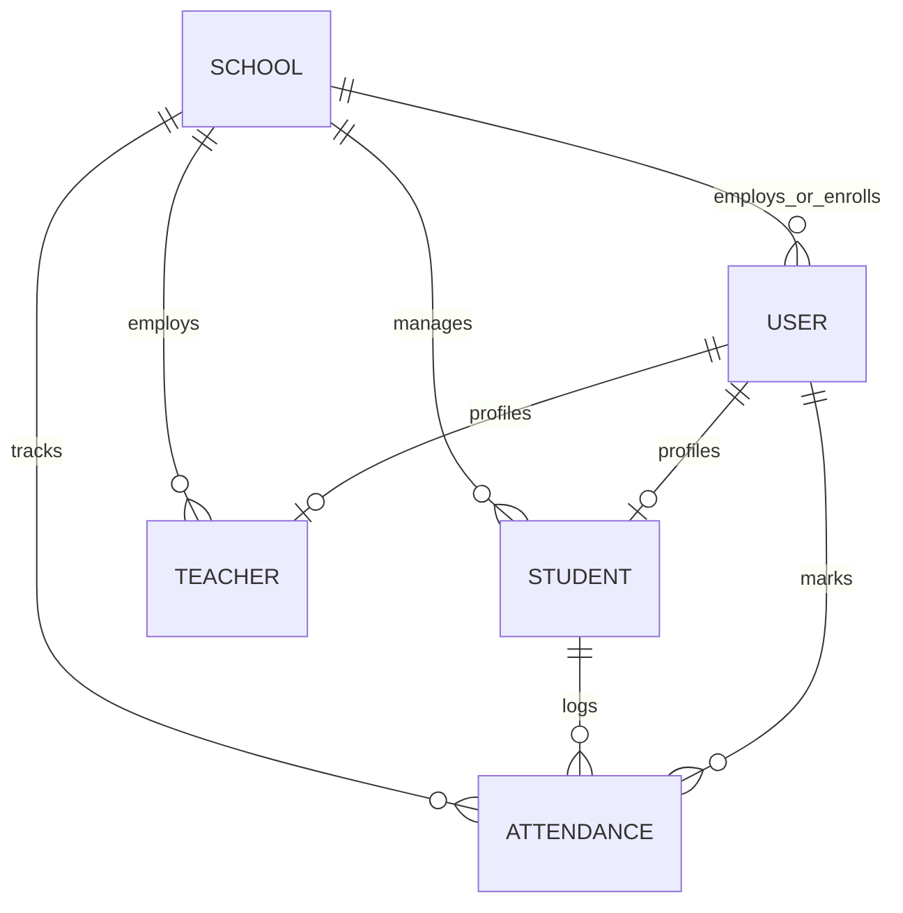

# School ERP - Multi-School Management System (MERN Stack)

A complete, production-ready, and assessment-ready **Multi-School School ERP System** built using the MERN Stack. The application implements role-based access control, school onboarding approvals, strict multi-school data isolation, teacher and student management, attendance recording, and responsive dashboards for all four roles.

---

## 🌟 Key Features

1. **JWT-Based Authentication**: Secure login, logout, and session restoration using HTTP-only cookies (`token`).
2. **Role-Based Authorization**: Scopes and middleware restricting API endpoints and frontend pages to exactly four roles: `super_admin`, `school_admin`, `teacher`, and `student`.
3. **School Onboarding Approval Workflow**: Public school registration form creating a school with status `pending`. Full Super Admin dashboard reviewing, approving, or rejecting applications.
4. **Strict School-Level Data Isolation**: School Admins and Teachers can only manage/view rosters within their own school. Data queries are automatically scoped using the authenticated user's `schoolId` (never trusting frontend parameters for scoping).
5. **Student & Teacher Management CRUD**: Fully functional management views for onboarding faculty and enrolling students.
6. **Attendance Management Registry**: Interactive grading roster for teachers to mark daily attendance. Custom bulk update upserts prevent duplicate records. Students can only audit their own attendance history.
7. **Premium Responsive Dashboards**: Unique layouts tailored with Lucide-React icons, responsive sidebars, cards, and custom CSS/SVG statistics widgets.

---

## 🛠️ Technology Stack

* **Frontend**: React.js, Vite, Tailwind CSS, React Router DOM, Axios, Zustand (State Management), Lucide React.
* **Backend**: Node.js, Express.js, MongoDB (Mongoose), JSON Web Tokens (JWT), bcryptjs (Hashing), Zod (Request Validation), Helmet, Express Rate Limit.

---

## 📊 Database Schema / ER Diagram

Below is the Mermaid Entity Relationship Diagram illustrating the database architecture:



### Collection Model Schema Definitions

1. **School**: Name, Code (Unique), Email (Unique), Phone, Address, City, State, Status (pending/approved/rejected), ApprovedBy (Ref User), ApprovedAt (Date).
2. **User**: Name, Email (Unique), Password (hashed), Role (super_admin/school_admin/teacher/student), School (Ref School), isActive (Boolean).
3. **Student**: User (Ref User, Unique), School (Ref School), RollNumber (Unique within school), Class, Section, DateOfBirth, Gender, Phone, Address.
4. **Teacher**: User (Ref User, Unique), School (Ref School), EmployeeId (Unique within school), Phone, Gender, Qualification, Subjects (Array), AssignedClasses (Array of Class-Section strings).
5. **Attendance**: Student (Ref Student), School (Ref School), Class, Section, Date (Normalized to midnight), Status (present/absent/late), MarkedBy (Ref User). Compound Unique Index: `{ student: 1, date: 1 }`.

---

## 📂 Folder Structure

```text
school-erp/
├── backend/
│   ├── src/
│   │   ├── config/          # Database connection
│   │   ├── controllers/     # Modular business logic
│   │   ├── middleware/      # Auth & Error handling
│   │   ├── models/          # Mongoose model definitions
│   │   ├── routes/          # Express route bindings
│   │   ├── validators/      # Zod schema definitions
│   │   ├── utils/           # Operational errors & tokens
│   │   └── app.js           # App setup
│   ├── .env.example
│   └── package.json
├── frontend/
│   ├── src/
│   │   ├── api/             # Axios API client
│   │   ├── components/      # Common UI & Layouts
│   │   ├── pages/           # Pages grouped by role
│   │   ├── store/           # Zustand auth store
│   │   ├── App.jsx          # Routing mount
│   │   └── main.jsx         # App mounting point
│   ├── .env.example
│   ├── tailwind.config.js
│   ├── postcss.config.js
│   └── package.json
└── README.md
```

---

## 🚀 Local Setup Instructions

### Prerequisites
* Node.js (v16+)
* MongoDB Server (Running locally or MongoDB Atlas connection string)

### 1. Clone & Position
```bash
git clone <repository-url>
cd "School ERP"
```

### 2. Backend Setup
1. Open the backend directory and install modules:
   ```bash
   cd backend
   npm install
   ```
2. Copy the environment template:
   ```bash
   cp .env.example .env
   ```
3. Ensure MongoDB is running and update the `MONGODB_URI` and `JWT_SECRET` in `.env` if necessary.
4. Seed the database with default credentials and approved demo profiles:
   ```bash
   npm run seed
   ```
5. Start the backend developer server (starts on Port 5000):
   ```bash
   npm run dev
   ```

### 3. Frontend Setup
1. Open a new terminal window in the frontend directory and install modules:
   ```bash
   cd ../frontend
   npm install
   ```
2. Copy the client environment template:
   ```bash
   cp .env.example .env
   ```
3. Start the Vite developer server (starts on Port 5173):
   ```bash
   npm run dev
   ```
4. Access the web portal in your browser at `http://localhost:5173`.

---

## 🔑 Demo Development Credentials

### 1. Super Admin (System Reviewer)
* **Email**: `superadmin@schoolerp.com`
* **Password**: `Admin@123`

### 2. School Admin (Greenwood High School)
* **Email**: `admin@greenwood.com`
* **Password**: `Admin@123`

### 3. Teacher (Greenwood High School)
* **Email**: `alice@greenwood.com` (Class Teacher for 10-A and 9-B)
* **Password**: `Teacher@123`

### 4. Student (Greenwood High School)
* **Email**: `charlie@greenwood.com` (Enrolled in 10-A)
* **Password**: `Student@123`

---

## 🌐 API Reference Overview

| Method | Endpoint | Access Role | Description |
| :--- | :--- | :--- | :--- |
| **POST** | `/api/auth/login` | Public | Logs in user, issues HTTP-only Cookie. |
| **POST** | `/api/auth/logout` | Private | Logs out user and clears token cookie. |
| **GET** | `/api/auth/me` | Private | Fetches current logged-in user profile. |
| **POST** | `/api/schools/register` | Public | Onboards a new school (Status: pending). |
| **GET** | `/api/schools` | Super Admin | Lists all onboarded schools. |
| **GET** | `/api/schools/:id` | Super Admin | Fetches details and admin details for a school. |
| **PATCH**| `/api/schools/:id/approve` | Super Admin | Approves a school application. |
| **PATCH**| `/api/schools/:id/reject` | Super Admin | Rejects a school application. |
| **GET** | `/api/schools/stats` | School Admin/Teacher | Aggregates dashboard enrollment and attendance stats. |
| **GET** | `/api/students` | Admin/Teacher/Student | Lists students in school (data isolated). |
| **POST** | `/api/students` | School Admin | Enrolls a student & generates User account. |
| **PUT** | `/api/students/:id` | School Admin | Updates student details. |
| **DELETE**| `/api/students/:id` | School Admin | Deletes student profile & User account. |
| **GET** | `/api/teachers` | Admin/Teacher/Student | Lists teachers in school. |
| **POST** | `/api/teachers` | School Admin | Onboards a teacher & generates User account. |
| **PUT** | `/api/teachers/:id` | School Admin | Updates teacher profile. |
| **DELETE**| `/api/teachers/:id` | School Admin | Deletes teacher profile & User account. |
| **POST** | `/api/attendance` | Teacher | Marks student attendance register. |
| **GET** | `/api/attendance` | School Admin/Teacher | Lists attendance reports (date/class filtered). |
| **GET** | `/api/attendance/student/:id`| Admin/Teacher/Student | Audits attendance logs for a specific student. |
